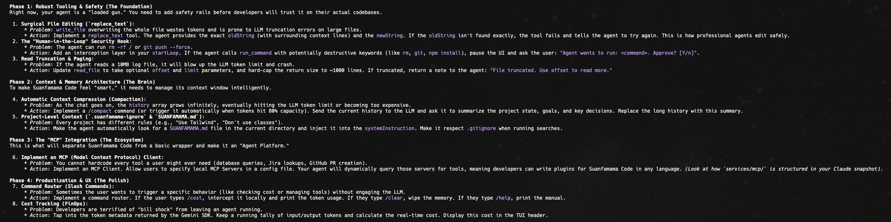

# Suanfamama Code
## design principles
### the reAct loop
* Reason: It understood it needed to modify a file.
* Decide: It chose the specific append_to_file tool to be safe.
* Execute: It generated its own content ("// TODO: Implement more sophisticated decision making") and wrote it to your disk.
* Verify: It confirmed the action was successful.

### the Agentic Stack (the core architecture)
* the Brain: Google Gemini 2.0 Flash (Fast reasoning).
* the Hands: child_process and fs (Real-world impact).
* the Protocol: Function Calling / ReAct Loop (Structured coordination).
* the Governance: System Instructions (Safety and behavior guardrails).

### the Current Agent Engineering Roadmap

### the Target Audience
* People who want to become an AI Agent Engineer

### the Core Concepts
* chat or agent behavior